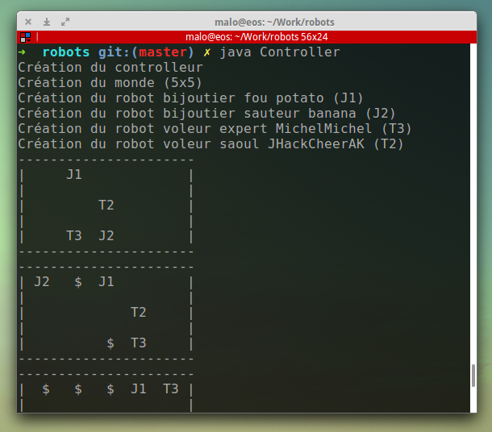

#Robots project

###(under construction)




###Changelog
```
v0.8 (2014-12-27)
 - Working interface!
 - Refactoring (views, models)
v0.7 (2014-12-27)
 - Refactoring (better MVC, org folder)
 - Use of environment variables
 - First window made with Swing to test functionalities
v0.6 (2014-12-22)
 - MVC architecture (folders & packages)
v0.6 (2014-12-21)
 - JewelerJumper now works like a knight chess
v0.5 (2014-12-19)
 - Working JewelerMadman + better code + banner
 - Bugfix + more robots + better architecture
 - Implementing a timer + some bugfix
 - Little update + adding Thief robots
 - Some bugfix + jewelers are now able to drop jewels
 - Starting project
```
