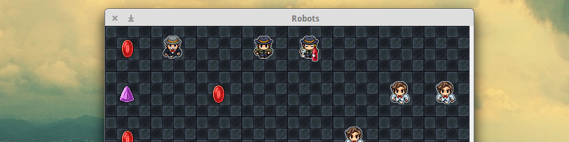

#Robots



Robots is a school project made for my fird year at EPSI Nantes.
 It's my first Java project. The code is o  bject oriented, MVC and commented.
 It's a classic polluter/cleaner game, without user interraction. The main
 goal was to produce a fully functional game with different types of robots, a
 graphic view and the better code as possible for a beginner in Java. In this
 game, I made four different types of robots:

1. **JewelerMadman**: this one drops a jewel on the current cell and moves on the borders.  
 

2. **JewelerJumper**: this one drops a jewel on the current cell and moves like a Chess rider.  
 

3. **ThiefExpert**: this one steal the jewel he found on the cell and move on a random adjacent cell.  
 

4. **ThiefDrunked**: because of alchool problems, this one forgets sometimes to steal the jewel.  
 


###Use
```
git clone git@github.com:maloblanchard/robots.git
cd robots/
javac App.java
java App {x-cells} {y-cells} {speed}
#eg: java App 10 10 500

```


###Requirements
Java JDK correctly installed.


###Troubleshooting
####ERR: "main class not found"
```
CLASSPATH=/{absolute-path-to-the-game}/robots;
#eg: CLASSPATH=/home/malo/robots;
export CLASSPATH;
```


###Ideas, Bugs
Don't hesitate to [contact me](http://maloblanchard.com/contact).


###Changelog
```
v1.0 (2014-12-28)
 - New banner
 - README remade + adding images for robot movement
 - Adding a Changelog and a LICENCE file
 - Jewel has now differents types, randomly atributed
 - Old theme is now called v0 and is on it's own folder
 - New theme for the v1
v0.9
 - use of getCell() instead of direct access to a public property in World
 - All classes and methods are documented
 - Removing print/println from the code
```
